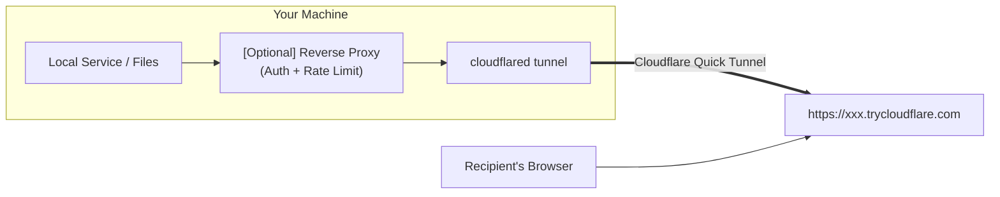

<h1 align="center">☁️ CFShare</h1>

<p align="center">
Securely share local files and services to the public internet via Cloudflare Tunnel
</p>

<p align="center">
  
  
  
  
</p>

<p align="center">
  <a href="./README.zh.md">简体中文</a>
  &nbsp;|&nbsp;
  <strong>English</strong>
</p>

---

## 📖 What Is This?

**CFShare** is a community plugin for [OpenClaw](https://github.com/openclaw/openclaw) that enables your AI assistant to:

- 🔗 **Expose a local port** as a temporary public HTTPS link (`https://*.trycloudflare.com`) with one command
- 📁 **Share files/directories** — automatically spins up a local static server + tunnel so recipients can browse/download/preview via a link (encryption supported)
- 🔒 **Built-in security** — Token/Basic auth, rate limiting, port blacklist, exclusion rules
- ⏱️ **Auto-expiry cleanup** — tunnels are automatically closed and temp files deleted when the TTL expires

> [!NOTE]
> **No Cloudflare account required.** CFShare uses [Cloudflare Quick Tunnel](https://developers.cloudflare.com/cloudflare-one/connections/connect-networks/do-more-with-tunnels/trycloudflare/) (`trycloudflare.com`), which is completely free and works out of the box.

---

## 🏗️ How It Works



Internally, CFShare handles: path validation → copy files to a temp directory → start a read-only static server → mount auth/rate-limit reverse proxy → launch `cloudflared` tunnel → schedule expiry cleanup. All you need to do is tell the AI "what you want to share" and it takes care of the rest.

---

## 🚀 Installation

### Step 1: Make Sure OpenClaw Is Installed

If you haven't installed OpenClaw yet, do so first:

```bash
# Install OpenClaw (requires Node.js ≥ 22)
npm install -g openclaw@latest

# Run the onboarding wizard
openclaw onboard --install-daemon
```

> [!TIP]
> Not sure about your Node.js version? Run `node -v` to check. [nvm](https://github.com/nvm-sh/nvm) is recommended for managing versions.

---

### Step 2: Install `cloudflared`

CFShare relies on Cloudflare's `cloudflared` CLI to create tunnels.

<details>
<summary><b>🍎 macOS</b></summary>

```bash
brew install cloudflare/cloudflare/cloudflared
```

</details>

<details>
<summary><b>🐧 Linux (Debian / Ubuntu)</b></summary>

```bash
curl -fsSL https://pkg.cloudflare.com/cloudflare-main.gpg | sudo tee /usr/share/keyrings/cloudflare-main.gpg >/dev/null
echo "deb [signed-by=/usr/share/keyrings/cloudflare-main.gpg] https://pkg.cloudflare.com/cloudflared $(lsb_release -cs) main" | sudo tee /etc/apt/sources.list.d/cloudflared.list
sudo apt-get update && sudo apt-get install cloudflared
```

</details>

<details>
<summary><b>🪟 Windows (inside WSL2)</b></summary>

```bash
# Inside WSL2:
curl -fsSL https://github.com/cloudflare/cloudflared/releases/latest/download/cloudflared-linux-amd64 -o /usr/local/bin/cloudflared
chmod +x /usr/local/bin/cloudflared
```

Or install natively via PowerShell / CMD with winget:

```powershell
winget install --id Cloudflare.cloudflared
```

</details>

**Or simply ask the Agent to install it for you.**

Verify the installation:

```bash
cloudflared --version
# Output should be similar to: cloudflared version 2025.x.x
```

> [!IMPORTANT]
> You only need to install `cloudflared` — there is **no need** to run `cloudflared tunnel login`. Quick Tunnel requires no account authentication.

---

### Step 3: Install the CFShare Plugin

**Option A — Install from npm (recommended):**

```bash
openclaw plugins install @ystemsrx/cfshare
# After installation, restart the Gateway:
openclaw gateway restart
```

**Option B — Install from a local directory (for development):**

If you've already cloned the repository:

```bash
# Install dependencies first
cd /path/to/cfshare
npm install

# Link to OpenClaw (dev mode, no file copying)
openclaw plugins install -l .
```

---

### Step 4: Enable the Plugin and Restart the Gateway

```bash
# Enable the plugin
openclaw plugins enable cfshare

# Restart the Gateway to load the plugin
openclaw gateway restart
```

> [!NOTE]
> If you're running in daemon mode (`--install-daemon`), you can also restart via `openclaw restart`.

---

## 🖥️ Direct CLI Usage (No OpenClaw Required)

You can now call CFShare directly from the terminal after npm installation:

```bash
npm install -g @ystemsrx/cfshare
cfshare env_check
```

Common examples:

```bash
# Expose an existing local service
cfshare expose_port '{"port":3000,"opts":{"access":"token"}}'

# Share files/directories
cfshare expose_files '{"paths":["./dist"],"opts":{"access":"none"}}'

# Stop an exposure
cfshare exposure_stop '{"id":"all"}'
```

`expose_port` and `expose_files` print the result and exit by default.
Use `--keep-alive` if you want foreground lifecycle control (`Ctrl+C` to stop).

When running as CLI, CFShare uses `~/.cfshare` by default for state, workspaces, policy, and audit files.
This is isolated from plugin mode (`~/.openclaw/cfshare`) so both can coexist safely.

---

## ⚙️ Configuration (Optional)

CFShare works out of the box. The defaults below suit most use cases. To customize, edit `~/.openclaw/openclaw.json`:

```json5
{
  plugins: {
    entries: {
      cfshare: {
        enabled: true,
        config: {
          // Custom configuration (all fields are optional)
        },
      },
    },
  },
}
```

### Configuration Reference

| Option                     | Default               | Description                              |
| :------------------------- | :-------------------- | :--------------------------------------- |
| `cloudflaredPath`          | `"cloudflared"`       | Path or command name for `cloudflared`   |
| `stateDir`                 | `~/.openclaw/cfshare` | Directory for state file storage         |
| `defaultTtlSeconds`        | `3600` (1 hour)       | Default tunnel time-to-live              |
| `maxTtlSeconds`            | `86400` (24 hours)    | Maximum TTL cap                          |
| `defaultExposePortAccess`  | `"token"`             | Default auth mode for port exposure      |
| `defaultExposeFilesAccess` | `"none"`              | Default auth mode for file sharing       |
| `blockedPorts`             | `[22, 2375, 2376]`   | Ports blocked from exposure (SSH/Docker) |
| `rateLimit.enabled`        | `true`                | Whether rate limiting is enabled         |
| `rateLimit.maxRequests`    | `240`                 | Max requests per window                  |
| `rateLimit.windowMs`       | `60000` (1 minute)    | Rate limit window in milliseconds        |

> [!TIP]
> **Auth mode reference:**
>
> - `"token"` — A token is required to access the link (suitable for port exposure)
> - `"basic"` — HTTP Basic authentication (username/password)
> - `"none"` — No authentication, anyone can access (suitable for temporary file sharing)

---

## 💬 Usage Examples

Once installed, just speak naturally to your AI assistant — it will automatically invoke the appropriate CFShare tools:

### Get AI-Processed Files

> _"Rename all files under `/mnt/data/students/` to `{index}_{name}.{ext}` format, then bundle them up and give me a download link."_

The Agent will automatically call `expose_files` and return a public link along with its expiration time.

### Share Your Creations

> _"Build a 3D interactive solar system model with Vue 3 + Vite, then share it with my friend via a link."_

> _"Run this project for me and send me the link to access it."_

The Agent will create and run the project, then use `expose_port` to create a tunnel so anyone can access it through a link.

### Share a Directory (with File Browser) — preview images/videos/text in-browser, or download (encryption supported)

> _"Share the directory `~/Pictures/vacation` with encryption."_

The Agent will use `expose_files` in `preview` mode to create a share page with a file browser. A valid token is required to access it.

### View Active Shares

> _"What links do I have active right now?"_

### Stop Sharing

> _"Shut down all active share links."_

---

## 🧰 Tool Overview

CFShare registers the following tools for the AI:

| Tool            | Purpose                                           |
| :-------------- | :------------------------------------------------ |
| `env_check`     | Check if `cloudflared` is available & view policy  |
| `expose_port`   | Expose a local port to the public internet        |
| `expose_files`  | Share files/directories (auto static server)      |
| `exposure_list` | List all active sessions                          |
| `exposure_get`  | Get details for a specific session                |
| `exposure_stop` | Stop and clean up specific or all sessions        |
| `exposure_logs` | View session logs                                 |
| `maintenance`   | TTL guardian / garbage collection / policy refresh |
| `audit_query`   | Query audit logs                                  |
| `audit_export`  | Export audit logs to a file                       |

---

## 🔐 Security Design

<table>
<tr><td>🛡️</td><td><b>Secure by Default</b></td><td>Port exposure defaults to token auth + reverse proxy protection</td></tr>
<tr><td>🚫</td><td><b>Port Blacklist</b></td><td>SSH (22) and Docker Daemon (2375/2376) are blocked by default</td></tr>
<tr><td>⏳</td><td><b>Auto Expiry</b></td><td>Sessions automatically close tunnels and delete temp files upon expiration</td></tr>
<tr><td>📊</td><td><b>Rate Limiting</b></td><td>Per-IP sliding window rate limiting (default: 240 req/min)</td></tr>
<tr><td>📝</td><td><b>Audit Logging</b></td><td>All operations are logged to a local JSONL file</td></tr>
<tr><td>🙈</td><td><b>File Exclusion</b></td><td>Automatically excludes <code>.git/</code>, <code>.openclaw/</code>, and respects <code>.gitignore</code> rules</td></tr>
</table>

---

## ❓ FAQ

<details>
<summary><b>Q: Do I need a paid Cloudflare account?</b></summary>

No. CFShare uses Cloudflare Quick Tunnel (`trycloudflare.com`), which is completely free and requires no account registration.

</details>

<details>
<summary><b>Q: How long do links last?</b></summary>

By default, 1 hour. This can be adjusted via configuration or specified per share (up to 7 days). Links are automatically destroyed upon expiry.

</details>

<details>
<summary><b>Q: What if cloudflared is not found?</b></summary>

1. Confirm `cloudflared` is installed: `cloudflared --version`
2. If it's installed in a location not in your `PATH`, specify the full path in the config:

```json5
{
  plugins: {
    entries: {
      cfshare: {
        config: { cloudflaredPath: "/usr/local/bin/cloudflared" },
      },
    },
  },
}
```

</details>

<details>
<summary><b>Q: Can I use it directly on Windows?</b></summary>

OpenClaw officially strongly recommends using WSL2 on Windows. CFShare follows the same guidance — please use it within a WSL2 environment.

</details>

<details>
<summary><b>Q: How do I verify the plugin installed correctly?</b></summary>

```bash
openclaw plugins list
# You should see cfshare listed as enabled
```

Then tell the AI _"Run the cfshare environment check"_ — it will call `env_check` and return detailed status information.

</details>

---

## 📄 License

MIT © [ystemsrx](https://github.com/ystemsrx)
