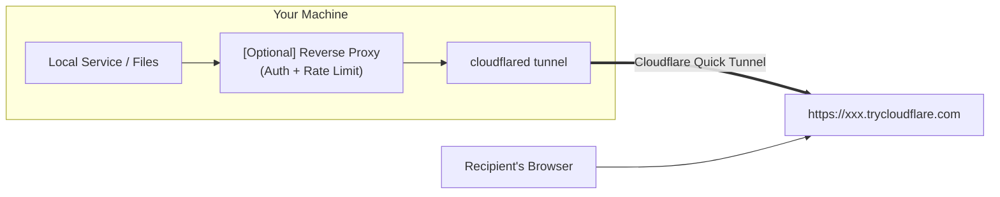

<h1 align="center">☁️ CFShare</h1>

<p align="center">
Securely share local files and services to the public internet via Cloudflare Tunnel
</p>

<p align="center">
  
  
  
</p>

<p align="center">
  <a href="./README.zh.md">简体中文</a>
  &nbsp;|&nbsp;
  <strong>English</strong>
</p>

---

## ⚡ Quick Start

```bash
# Install
npm install -g @ystemsrx/cfshare

# Or use as an Agent Skill (Claude Code, Codex, etc.)
npx skills add ystemsrx/cfshare

# Expose a local service
cfshare expose_port '{"port":3000}'

# Share files
cfshare expose_files '{"paths":["./dist"]}'
```

---

## 📖 What Is This?

**CFShare** is a Node.js CLI tool that enables you to:

- 🔗 **Expose a local port** as a temporary public HTTPS link (`https://*.trycloudflare.com`) with one command
- 📁 **Share files/directories** — automatically spins up a local static server + tunnel so recipients can browse/download/preview via a link (encryption supported)
- 🔒 **Built-in security** — Token/Basic auth, rate limiting, port blacklist, exclusion rules
- ⏱️ **Auto-expiry cleanup** — tunnels are automatically closed and temp files deleted when the TTL expires

> [!NOTE]
> **No Cloudflare account required.** CFShare uses [Cloudflare Quick Tunnel](https://developers.cloudflare.com/cloudflare-one/connections/connect-networks/do-more-with-tunnels/trycloudflare/) (`trycloudflare.com`), which is completely free and works out of the box.

---

## 🏗️ How It Works


```mermaid
flowchart LR
    subgraph LOCAL["Your Machine"]
        A["Local Service / Files"]
        B["[Optional] Reverse Proxy<br/>(Auth + Rate Limit)"]
        C["cloudflared tunnel"]

        A --> B
        B --> C
    end

    C ==>|Cloudflare Quick Tunnel| D["https://xxx.trycloudflare.com"]
    E["Recipient's Browser"] --> D
```

Internally, CFShare handles: path validation → copy files to a temp directory → start a read-only static server → mount auth/rate-limit reverse proxy → launch `cloudflared` tunnel → schedule expiry cleanup. All you need to do is tell it "what you want to share" and it takes care of the rest.

---

## 🚀 Installation

### Step 1: Install `cloudflared`

CFShare relies on Cloudflare's `cloudflared` CLI to create tunnels.

<details>
<summary><b>🍎 macOS</b></summary>

```bash
brew install cloudflare/cloudflare/cloudflared
```

</details>

<details>
<summary><b>🐧 Linux (Debian / Ubuntu)</b></summary>

```bash
curl -fsSL https://pkg.cloudflare.com/cloudflare-main.gpg | sudo tee /usr/share/keyrings/cloudflare-main.gpg >/dev/null
echo "deb [signed-by=/usr/share/keyrings/cloudflare-main.gpg] https://pkg.cloudflare.com/cloudflared $(lsb_release -cs) main" | sudo tee /etc/apt/sources.list.d/cloudflared.list
sudo apt-get update && sudo apt-get install cloudflared
```

</details>

<details>
<summary><b>🪟 Windows (inside WSL2)</b></summary>

```bash
# Inside WSL2:
curl -fsSL https://github.com/cloudflare/cloudflared/releases/latest/download/cloudflared-linux-amd64 -o /usr/local/bin/cloudflared
chmod +x /usr/local/bin/cloudflared
```

Or install natively via PowerShell / CMD with winget:

```powershell
winget install --id Cloudflare.cloudflared
```

</details>

Verify the installation:

```bash
cloudflared --version
# Output should be similar to: cloudflared version 2025.x.x
```

> [!IMPORTANT]
> You only need to install `cloudflared` — there is **no need** to run `cloudflared tunnel login`. Quick Tunnel requires no account authentication.

---

### Step 2: Install CFShare

```bash
npm install -g @ystemsrx/cfshare
```

Verify:

```bash
cfshare --version
cfshare env_check
```

---

## 🤖 Use as an Agent Skill

CFShare provides an Agent Skill that lets AI coding assistants (such as Claude Code, Codex, etc.) automatically call CFShare commands. Install the skill with:

```bash
npx skills add ystemsrx/cfshare
```

Once installed, just talk to your AI coding assistant in natural language:

> _"Expose port 3000 with token auth"_

> _"Share the `./dist` directory via a public link"_

> _"Stop all active shares"_

The agent will automatically invoke the appropriate `cfshare` commands and return the results.

---

## 🖥️ Usage

```bash
cfshare <command> [params-json] [options]
```

### Common Examples

```bash
# Check environment and policy
cfshare env_check

# Expose an existing local service
cfshare expose_port '{"port":3000,"opts":{"access":"token"}}'

# Share files/directories
cfshare expose_files '{"paths":["./dist"],"opts":{"access":"none"}}'

# List active exposures
cfshare exposure_list

# Stop an exposure
cfshare exposure_stop '{"id":"all"}'
```

`expose_port` and `expose_files` print the result and exit by default.
Use `--keep-alive` if you want foreground lifecycle control (`Ctrl+C` to stop).

### Options

| Option                  | Description                              |
| :---------------------- | :--------------------------------------- |
| `--params <json>`       | Tool parameters as JSON                  |
| `--params-file <path>`  | Read tool parameters from a JSON file    |
| `--config <json>`       | Runtime config JSON                      |
| `--config-file <path>`  | Read runtime config from a JSON file     |
| `--workspace-dir <dir>` | Workspace dir for `expose_files` context |
| `--keep-alive`          | Keep process running after `expose_*`    |
| `--no-keep-alive`       | Exit after printing result (default)     |
| `--compact`             | Compact JSON output                      |
| `-h, --help`            | Show help                                |
| `-v, --version`         | Show version                             |

---

## ⚙️ Configuration (Optional)

CFShare works out of the box. The defaults below suit most use cases. To customize, pass `--config` or `--config-file`:

```bash
cfshare expose_port '{"port":3000}' --config '{"defaultTtlSeconds":7200}'
```

Or create a config file (e.g. `~/.cfshare/config.json`):

```json
{
  "cloudflaredPath": "cloudflared",
  "defaultTtlSeconds": 3600,
  "defaultExposePortAccess": "token"
}
```

```bash
cfshare expose_port '{"port":3000}' --config-file ~/.cfshare/config.json
```

### Configuration Reference

| Option                     | Default            | Description                              |
| :------------------------- | :----------------- | :--------------------------------------- |
| `cloudflaredPath`          | `"cloudflared"`    | Path or command name for `cloudflared`   |
| `stateDir`                 | `~/.cfshare`       | Directory for state file storage         |
| `defaultTtlSeconds`        | `3600` (1 hour)    | Default tunnel time-to-live              |
| `maxTtlSeconds`            | `86400` (24 hours) | Maximum TTL cap                          |
| `defaultExposePortAccess`  | `"token"`          | Default auth mode for port exposure      |
| `defaultExposeFilesAccess` | `"none"`           | Default auth mode for file sharing       |
| `blockedPorts`             | `[22, 2375, 2376]` | Ports blocked from exposure (SSH/Docker) |
| `rateLimit.enabled`        | `true`             | Whether rate limiting is enabled         |
| `rateLimit.maxRequests`    | `240`              | Max requests per window                  |
| `rateLimit.windowMs`       | `60000` (1 minute) | Rate limit window in milliseconds        |

> [!TIP]
> **Auth mode reference:**
>
> - `"token"` — A token is required to access the link (suitable for port exposure)
> - `"basic"` — HTTP Basic authentication (username/password)
> - `"none"` — No authentication, anyone can access (suitable for temporary file sharing)

---

## 🧰 Command Reference

| Command         | Purpose                                            |
| :-------------- | :------------------------------------------------- |
| `env_check`     | Check if `cloudflared` is available & view policy  |
| `expose_port`   | Expose a local port to the public internet         |
| `expose_files`  | Share files/directories (auto static server)       |
| `exposure_list` | List all active sessions                           |
| `exposure_get`  | Get details for a specific session                 |
| `exposure_stop` | Stop and clean up specific or all sessions         |
| `exposure_logs` | View session logs                                  |
| `maintenance`   | TTL guardian / garbage collection / policy refresh |
| `audit_query`   | Query audit logs                                   |
| `audit_export`  | Export audit logs to a file                        |

---

## 🔐 Security Design

<table>
<tr><td>🛡️</td><td><b>Secure by Default</b></td><td>Port exposure defaults to token auth + reverse proxy protection</td></tr>
<tr><td>🚫</td><td><b>Port Blacklist</b></td><td>SSH (22) and Docker Daemon (2375/2376) are blocked by default</td></tr>
<tr><td>⏳</td><td><b>Auto Expiry</b></td><td>Sessions automatically close tunnels and delete temp files upon expiration</td></tr>
<tr><td>📊</td><td><b>Rate Limiting</b></td><td>Per-IP sliding window rate limiting (default: 240 req/min)</td></tr>
<tr><td>📝</td><td><b>Audit Logging</b></td><td>All operations are logged to a local JSONL file</td></tr>
<tr><td>🙈</td><td><b>File Exclusion</b></td><td>Automatically excludes <code>.git/</code>, <code>.cfshare/</code>, and respects <code>.gitignore</code> rules</td></tr>
</table>

---

## ❓ FAQ

<details>
<summary><b>Q: Do I need a paid Cloudflare account?</b></summary>

No. CFShare uses Cloudflare Quick Tunnel (`trycloudflare.com`), which is completely free and requires no account registration.

</details>

<details>
<summary><b>Q: How long do links last?</b></summary>

By default, 1 hour. This can be adjusted via configuration or specified per share (up to 7 days). Links are automatically destroyed upon expiry.

</details>

<details>
<summary><b>Q: What if cloudflared is not found?</b></summary>

1. Confirm `cloudflared` is installed: `cloudflared --version`
2. If it's installed in a location not in your `PATH`, specify the full path via `--config`:

```bash
cfshare env_check --config '{"cloudflaredPath":"/usr/local/bin/cloudflared"}'
```

</details>

<details>
<summary><b>Q: Can I use it directly on Windows?</b></summary>

CFShare is recommended for use within a WSL2 environment on Windows.

</details>

---

## 📄 License

MIT © [ystemsrx](https://github.com/ystemsrx)
