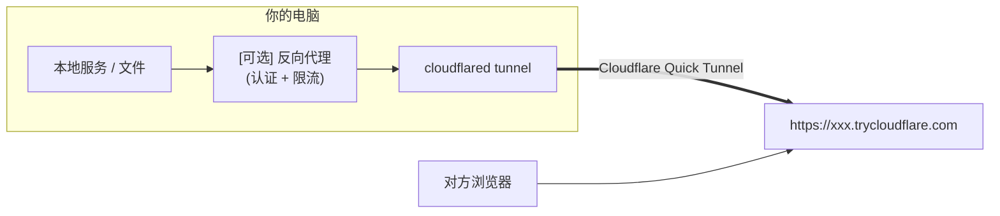

<h1 align="center">☁️ CFShare</h1>

<p align="center">
通过 Cloudflare 隧道安全地将本地文件与服务分享到公网
</p>

<p align="center">
  
  
  
  
</p>

<p align="center">
  <strong>简体中文</strong>
  &nbsp;|&nbsp;
  <a href="./README.md">English</a>
</p>

---

## 📖 这是什么？

**CFShare** 是 [OpenClaw](https://github.com/openclaw/openclaw) 的社区插件，让你的 AI 助手能够：

- 🔗 **一键将本地端口**暴露为临时公网 HTTPS 链接（`https://*.trycloudflare.com`）
- 📁 **分享文件/目录**——自动起本地静态服务器 + 隧道，对方打开链接即可浏览/下载/预览（支持加密）
- 🔒 **内置安全策略**——Token/Basic 认证、速率限制、端口黑名单、排除规则
- ⏱️ **自动过期清理**——TTL 到期自动关闭隧道并删除临时文件

> [!NOTE]
> **无需 Cloudflare 账号**。CFShare 使用的是 [Cloudflare Quick Tunnel](https://developers.cloudflare.com/cloudflare-one/connections/connect-networks/do-more-with-tunnels/trycloudflare/)（`trycloudflare.com`），完全免费、即开即用。

---

## 🏗️ 工作原理



CFShare 在内部完成：路径校验 → 文件复制到临时目录 → 启动只读静态服务器 → 挂载认证/限流反代 → 开启 `cloudflared` 隧道 → 设置过期回收。你只需告诉 AI “我要分享什么”，它会帮你完成剩下的工作。

---

## 🚀 安装步骤

### 第一步：确保已安装 OpenClaw

如果你还没有安装 OpenClaw，请先完成安装：

```bash
# 安装 OpenClaw（需要 Node.js ≥ 22）
npm install -g openclaw@latest

# 运行初始化向导
openclaw onboard --install-daemon
```

> [!TIP]
> 如果你不确定 Node.js 版本，运行 `node -v` 检查。推荐使用 [nvm](https://github.com/nvm-sh/nvm) 管理版本。

---

### 第二步：安装 `cloudflared`

CFShare 依赖 Cloudflare 的 `cloudflared` 命令行工具来创建隧道。

<details>
<summary><b>🍎 macOS</b></summary>

```bash
brew install cloudflare/cloudflare/cloudflared
```

</details>

<details>
<summary><b>🐧 Linux（Debian / Ubuntu）</b></summary>

```bash
curl -fsSL https://pkg.cloudflare.com/cloudflare-main.gpg | sudo tee /usr/share/keyrings/cloudflare-main.gpg >/dev/null
echo "deb [signed-by=/usr/share/keyrings/cloudflare-main.gpg] https://pkg.cloudflare.com/cloudflared $(lsb_release -cs) main" | sudo tee /etc/apt/sources.list.d/cloudflared.list
sudo apt-get update && sudo apt-get install cloudflared
```

</details>

<details>
<summary><b>🪟 Windows（WSL2 内操作）</b></summary>

```bash
# 在 WSL2 中：
curl -fsSL https://github.com/cloudflare/cloudflared/releases/latest/download/cloudflared-linux-amd64 -o /usr/local/bin/cloudflared
chmod +x /usr/local/bin/cloudflared
```

或在 Windows 原生 PowerShell / CMD 中使用 winget：

```powershell
winget install --id Cloudflare.cloudflared
```

</details>

**或者直接告诉 Agent 让他帮你安装**

安装后验证：

```bash
cloudflared --version
# 输出类似: cloudflared version 2025.x.x
```

> [!IMPORTANT]
> 只需安装 `cloudflared`，**不需要**运行 `cloudflared tunnel login`。Quick Tunnel 无需账号认证。

---

### 第三步：安装 CFShare 插件

**方式 A — 从 npm 安装（推荐）：**

```bash
openclaw plugins install @ystemsrx/cfshare
```

**方式 B — 从本地目录安装（适用于开发）：**

如果你已经克隆了仓库：

```bash
# 先安装依赖
cd /path/to/cfshare
npm install

# 链接到 OpenClaw（开发模式，不复制文件）
openclaw plugins install -l .
```

---

### 第四步：启用插件并重启 Gateway

```bash
# 启用插件
openclaw plugins enable cfshare

# 重启 Gateway 使插件生效
openclaw gateway restart
```

> [!NOTE]
> 如果你使用守护进程模式（`--install-daemon`），也可以通过 `openclaw restart` 重启。

---

## ⚙️ 配置（可选）

CFShare 开箱即用，以下默认配置适合绝大多数场景。如需调整，编辑 `~/.openclaw/openclaw.json`：

```json5
{
  plugins: {
    entries: {
      cfshare: {
        enabled: true,
        config: {
          // 自定义配置（以下皆为可选项）
        },
      },
    },
  },
}
```

### 可配置项速查

| 配置项                     | 默认值                | 说明                           |
| :------------------------- | :-------------------- | :----------------------------- |
| `cloudflaredPath`          | `"cloudflared"`       | `cloudflared` 的路径或名称     |
| `stateDir`                 | `~/.openclaw/cfshare` | 状态文件存储目录               |
| `defaultTtlSeconds`        | `3600`（1 小时）      | 默认隧道存活时间               |
| `maxTtlSeconds`            | `86400`（24 小时）    | 最大 TTL 上限                  |
| `defaultExposePortAccess`  | `"token"`             | 端口暴露默认认证模式           |
| `defaultExposeFilesAccess` | `"none"`              | 文件分享默认认证模式           |
| `blockedPorts`             | `[22, 2375, 2376]`    | 禁止暴露的端口（SSH / Docker） |
| `rateLimit.enabled`        | `true`                | 是否启用速率限制               |
| `rateLimit.maxRequests`    | `240`                 | 每窗口期最大请求数             |
| `rateLimit.windowMs`       | `60000`（1 分钟）     | 速率限制窗口（毫秒）           |

> [!TIP]
> **认证模式说明：**
>
> - `"token"` — 访问链接需要带 Token（适合暴露端口）
> - `"basic"` — HTTP Basic 认证（用户名/密码）
> - `"none"` — 无认证，任何人都可访问（适合临时分享文件）

---

## 💬 使用示例

安装完成后，你可以直接对 AI 助手说自然语言，它会自动调用 CFShare 工具：

### 获取 AI 处理好的文件

> _按照 `{index}_{name}.{ext}` 的格式整理 `/mnt/data/students/` 下所有文件名，最后打包发我下载链接_

Agent 会自动执行 `expose_files`，返回一个公网链接和过期时间。

### 分享你的作品

> _"用 Vue3+Vite 框架完成3D交互式太阳系模型，然后用链接分享给我朋友"_

>_"帮我运行这个项目，最后把链接发我访问"_

Agent 会创建项目并运行，然后通过 `expose_port` 创建隧道，让任何人都能通过一个链接访问。

### 分享目录（带文件浏览器），可以在浏览器中预览图片/视频/文本等，也可以下载（支持加密）

> _"加密分享目录 `~/Pictures/vacation`"_

Agent 会用 `expose_files` 的 `preview` 模式创建带文件浏览器的分享页面，你需要拥有有效的 Token 才能访问。

### 查看活跃分享

> _"我现在有哪些正在分享的链接？"_

### 停止分享

> _"关掉所有正在分享的链接"_

---

## 🧰 工具一览

CFShare 为 AI 注册了以下工具：

| 工具            | 作用                                  |
| :-------------- | :------------------------------------ |
| `env_check`     | 检查 `cloudflared` 是否可用及当前策略 |
| `expose_port`   | 暴露本地端口到公网                    |
| `expose_files`  | 分享文件/目录（自动起静态服务器）     |
| `exposure_list` | 列出所有活跃会话                      |
| `exposure_get`  | 获取指定会话详情                      |
| `exposure_stop` | 停止并清理指定/全部会话               |
| `exposure_logs` | 查看会话日志                          |
| `maintenance`   | TTL 守护 / 垃圾回收 / 策略更新        |
| `audit_query`   | 查询审计日志                          |
| `audit_export`  | 导出审计日志到文件                    |

---

## 🔐 安全设计

<table>
<tr><td>🛡️</td><td><b>默认安全</b></td><td>端口暴露默认开启 Token 认证 + 反向代理保护</td></tr>
<tr><td>🚫</td><td><b>端口黑名单</b></td><td>SSH (22)、Docker Daemon (2375/2376) 默认禁止暴露</td></tr>
<tr><td>⏳</td><td><b>自动过期</b></td><td>会话到期自动关闭隧道并删除临时文件</td></tr>
<tr><td>📊</td><td><b>速率限制</b></td><td>Per-IP 滑动窗口限流（默认 240 次/分钟）</td></tr>
<tr><td>📝</td><td><b>审计日志</b></td><td>所有操作记录到本地 JSONL 文件</td></tr>
<tr><td>🙈</td><td><b>文件排除</b></td><td>自动排除 <code>.git/</code>、<code>.openclaw/</code>，并遵守 <code>.gitignore</code> 规则</td></tr>
</table>

---

## ❓ 常见问题

<details>
<summary><b>Q: 需要 Cloudflare 付费账号吗？</b></summary>

不需要。CFShare 使用 Cloudflare Quick Tunnel（`trycloudflare.com`），完全免费，无需注册账号。

</details>

<details>
<summary><b>Q: 链接有效期多长？</b></summary>

默认 1 小时，可通过配置或每次分享时指定（最长 7 天）。到期后自动销毁。

</details>

<details>
<summary><b>Q: cloudflared 提示找不到怎么办？</b></summary>

1. 确认 `cloudflared` 已安装：`cloudflared --version`
2. 如果安装位置不在 `PATH` 中，在配置里指定完整路径：

```json5
{
  plugins: {
    entries: {
      cfshare: {
        config: { cloudflaredPath: "/usr/local/bin/cloudflared" },
      },
    },
  },
}
```

</details>

<details>
<summary><b>Q: 可以在 Windows 上直接用吗？</b></summary>

OpenClaw 官方强烈推荐在 Windows 上使用 WSL2。CFShare 同样遵循此建议，请在 WSL2 环境中使用。

</details>

<details>
<summary><b>Q: 如何验证插件是否安装成功？</b></summary>

```bash
openclaw plugins list
# 应该能看到 cfshare 处于 enabled 状态
```

然后对 AI 说 _"运行 cfshare 环境检查"_，它会调用 `env_check` 并返回详细状态。

</details>

---

## 📄 许可

MIT © [ystemsrx](https://github.com/ystemsrx)
